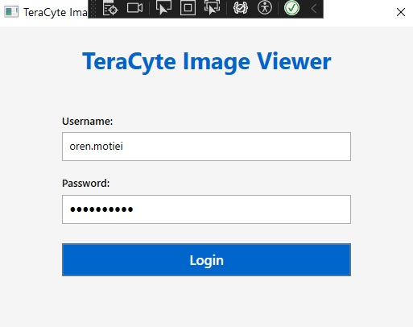
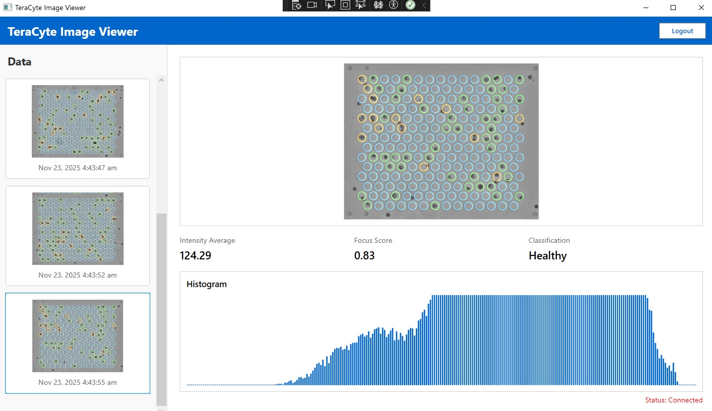
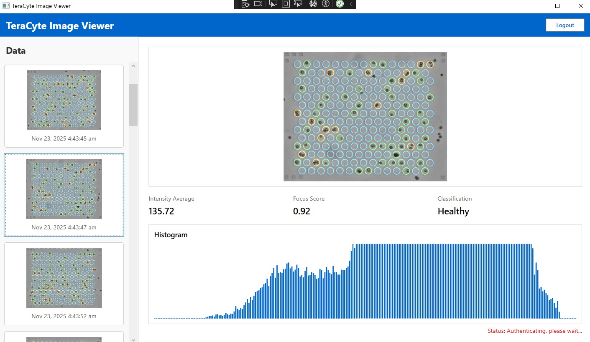
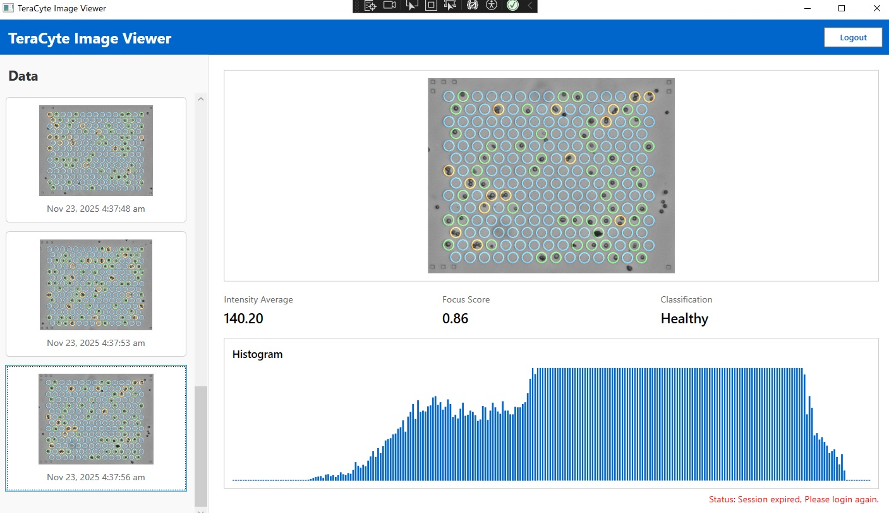

## Steps to run the application:
### Option 1 - Visual Studio:
1. Clone the repository.
2. Run the Solution file: /TeraImageViewer/TeraImageViewer.sln
3. Build and press F5 to run the app.

### Option 2 - Terminal:
1. Clone the repository.
2. Run:
cd TeraImageViewer
dotnet build
dotnet run

## Approach & Architecture:
I have used .NET WPF with MVVM + Dependency Injection.
Implemented a data polling service which polls the image and results endpoints every 2 seconds. 
We use a Dictionary for fast imageId lookups, and an ObservableCollection which will be used by a ListBox view.
If imageIds match we will store the relevant microscope data. If not, we store the valid image data.
We also search for the results data image id in the dictionary, and if found we will update
the relevant microscope data with the matching results. 
The UI is responsive and will update accordingly including event handlers.
I have also implemented optional bonus features.

## Screenshots:

